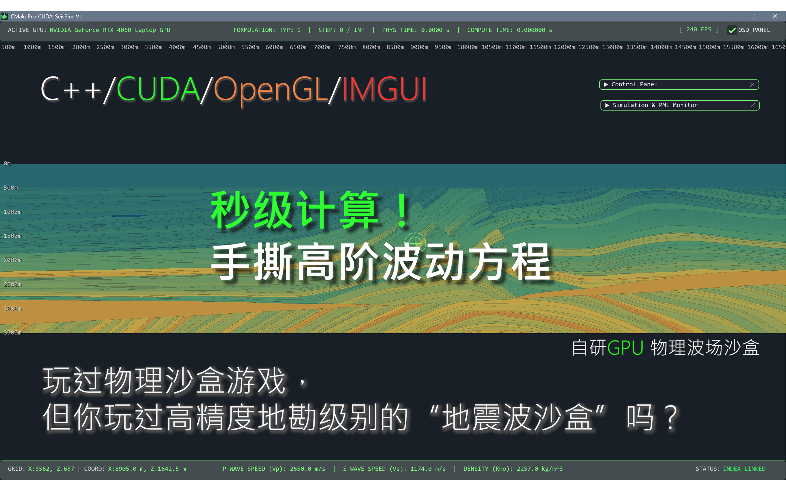
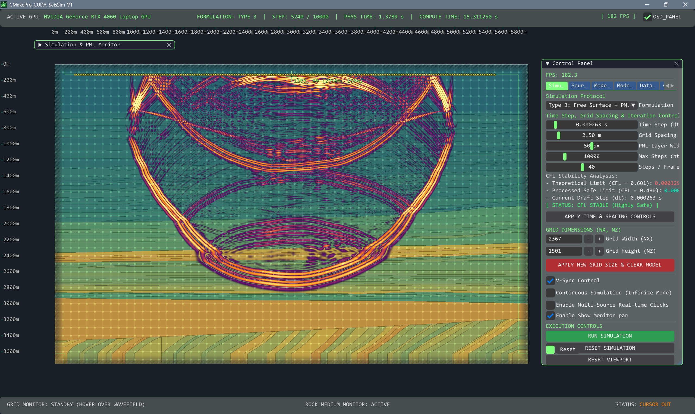
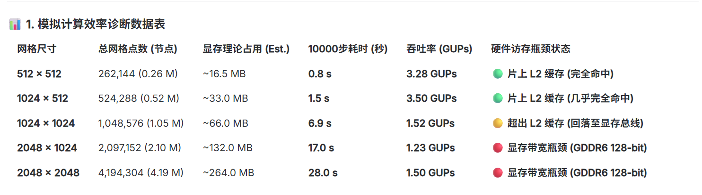

---

# 二维弹性波场实时数值模拟、采集与分析系统 (CMakePro_CUDA_SeisSim_V1)

## 导言
**CMakePro_CUDA_SeisSim_V1** 是一款基于 C++17 标准、NVIDIA CUDA 异构并行技术、OpenGL 4.3 图形管线以及 Dear ImGui / ImPlot 交互架构开发的实时二维弹性波场数值模拟、数据采集与剖面分析系统。该系统针对浅层地震勘探、岩石物理分析、学术方案验证和地学演示教学设计，旨在提供一个物理参数可调、波场交互即时、多通道地震记录可录制、画面高渲染品质的数值仿真“物理沙盒”平台。





通过将弹性波有限差分（FDM）方程求解全部迁移至 GPU，并深度优化显存与内存间的传输带宽，该系统在主流移动端显卡（如拥有 32MB L2 缓存的 RTX 4060 Laptop）上实测达到了 **5.0+ GNUPs**（每秒五十亿次网格点更新）的计算吞吐量，实现了亚秒级的万步高精度波动方程演化。

---

## 一、 技术架构 (Technical Architecture)

本系统采用**“状态参数控制层 - 物理计算层 - 渲染与互操作层”**相互解耦的三层软件架构，确保了计算的高吞吐量与界面的高帧率交互。

```
+-------------------------------------------------------------+
|                状态与参数控制层 (C++17 Host)                 |
|   - 窗口管理 (GLFW)   - 状态管理 (SimState)  - 数据 I/O 驱动   |
+------------------------------+------------------------------+
                               |
        +----------------------+----------------------+
        |                                             |
+-------v---------------------+             +---------v-------------------+
|     渲染层 (OpenGL 4.3)     |             |      物理计算层 (CUDA)      |
|  - 离屏渲染 (FBO)           |             |  - 8阶交错网格 FDM 求解器    |
|  - 自适应双轴联动物理标尺   |             |  - 3套 PML / 自由表面边界    |
|  - 7分量自适应物理尺度平衡  |             |  - 检波器波幅 GPU 并发提取  |
+-------+---------------------+             +---------+-------------------+
        |                                             |
        +----------------------+----------------------+
                               |
                               | (CUDA-GL Interop 零拷贝)
                               v
                +------------------------------+
                |   2D 实时弹性波场高帧率呈现  |
                +------------------------------+
```

### 1. 核心计算引擎 (CUDA 求解器)
*   **有限差分离散格式**：物理核心基于一阶速度-应力弹性波控制方程。空间上采用八阶 Staggered-Grid（交错网格），时间上采用二阶差分格式。通过将质点速度分量（$v_x, v_z$）和弹性应力分量（$\sigma_{xx}, \sigma_{zz}, \sigma_{xz}$）在网格空间半步长及时间轴上交替排布离散，消除了空间差分色散与“棋盘格”数值干扰。
*   **物理边界条件支持**：
    *   *Type 1 (全域 PML)*：边界区均使用分裂场（Split-field）完美匹配层（PML）吸收。
    *   *Type 2 (混合 FDM+PML)*：内域采用经典的非分裂场更新以节省计算带宽，仅在边界 PML 区域激活分裂变量。
    *   *Type 3 (自由表面条件)*：在模型顶端（$z=0$）加载自由表面边界条件（Traction-Free Boundary: $\sigma_{zz}=0, \sigma_{xz}=0$），模拟面波（Rayleigh波）的物理特征，其余三边采用 PML 吸收。
    *   *PML 流固边界稳定化*：针对弹性波 PML 吸收边界在流体介质（$V_s = 0$，如水层）中运行期极易指数发散的学术难题，系统实现了 **PML 内部介质安全固化机制**。外推边界时，自动将 PML 内部的水层固化为剪切波速非零的稳定固体介质（$V_s = V_p / 2$），彻底根除流固 PML 奇点，保障了数值仿真的长期稳定性。

### 2. 极致性能与工程优化策略
*   **CUDA-GL Interop（显存零拷贝）**：传统的 GPU 仿真在渲染时需要将波场显存数据拷回 CPU 内存，再重新上传至 OpenGL 纹理，这造成了极大的 PCIe 总线延迟。本系统将 OpenGL 纹理直接注册到 CUDA 互操作图形资源（`cudaGraphicsGLRegisterImage`），计算出的波场物理值在 GPU 内部直接映射重画并写入纹理目标，**实现了显卡内的高速自循环通道**。
*   **FBO（离屏帧缓冲区）渲染管线**：计算网格比例（如 $2267\times 1401$）与 ImGui 视口窗口的物理像素尺寸经常不一致。系统通过离屏帧缓冲（Framebuffer Object），将着色器（Shader）处理后的波场画面以正确的宽高比渲染到离屏纹理中，再提交至 ImGui 视口，完全消除了波场在窗口中的拉伸变形与白底残留。
*   **GPU 端检波器值并发抽取与 Host 包装驱动**：系统废弃了在 CPU 端拷贝整个网格提取检波器波形的方法，编写了专属的 `extract_receivers_kernel` 提取核函数和主机端 C++ 驱动 `recordReceiverStepGPU`。由 GPU 内部线程并发提取少量（如 120 个）检波器位置的值写入一个小显存块并拷回，每次**仅向 Host 传输几百字节的数据**，规避了 PCIe 管道同步阻塞。
*   **只读数据缓存与代数优化**：核函数内部的只读介质参数数组采用 `const float* __restrict__` 声明，引导编译器将 Stencil 邻域读取路由到只读数据缓存（`__ldg` 指令）；并将有限差分公式中的高延迟除法指令（Division）全部替换为线程顶部预先算好的乘法倒数（Reciprocal），降低了硬件指令延迟。

---

## 二、 优势特点 (Key Features)

### 1. 顶尖的实时运算算力与 L2 缓存命中分析
在 $1000 \times 500$ 尺寸、PML 宽度为 50 格的物理模型下进行 10,000 次时间步更新，在移动端 RTX 4060 显卡上实测耗时仅为 **`0.995` 秒**。吞吐量稳定在 **$5.02\text{ GNUPs}$**（Giga Node Updates per Second）。
*   **L2 缓存硬件机制**：由于移动端 RTX 4060 拥有完整的 32MB L2 缓存，在 $512 \times 512$ 和 $1024 \times 512$ 网格规模下，网格数据和差分 Stencil 邻域可以完全驻留在片上 SRAM 高速缓存内，获得高达 **$3.50\text{ GUPs}$** 的计算速度。一旦网格扩大超出 L2 限制，计算退化为受限的 VRAM 显存总线带宽。

### 2. 严谨的物理稳定性保障与自适应自动对齐 (CFL 时间锁)
在交互面板调节空间步长（$dx$）或时间步长（$dt$）时，系统会自动提取地层模型中的最大纵波速度 $V_{p, max}$，根据 2D 交错网格稳定系数公式实时计算并更新 CFL 稳定性极限值。
*   **自适应自动对齐（Auto-Align Time Step）**：系统在后台提供了一键自适应计算机制。每当用户加载预设、导入自定义模型或改变网格间距时，系统会自动重算 $V_{p, max}$，自动将 $dt$ 锁定在最完美的 **`0.48` 安全库朗数**上，并同步给 UI 滑块，**从根本上防止了因时间步长过大导致的数值溢出发散崩溃**。

### 3. 符合物理现实的跨量纲尺度平衡（Adaptive Scaling）
在弹性波场中，速度分量与应力分量（GPa 级别）在物理上相差 $10^7 \sim 10^9$ 倍。系统在色彩映射核函数内执行了**自适应物理平衡器（Adaptive Balancer）** [2]：
*   将应力分量除以本地弹性模量（`lambda2mu` 或 `mu`），在物理上转换为无量纲的**应变（Strain）尺度**（$10^{-6} \sim 10^{-3}$）。
*   根据 $v = V_p \cdot \epsilon$ 波动学关系，引入 $2000.0\text{x}$ 的物理补偿因子，使速度分量、正/剪应力、散度和旋度在同一个 `Color Gain` 控制下滑动时，自动展现出高度一致、平滑的画面对比度，免去频繁手动调整增益的麻烦。

### 4. 高精度的多源沙盒交互与平移同步
*   **多震源实时累加与消亡**：系统支持多震源模式。用户可以在屏幕上按压拖拽鼠标，系统会以 $25\text{Hz}$ 的高频间隔，在鼠标轨迹下持续注入具有独立物理衰减寿命的雷克子波源（Ricker Source），提供极佳的数值物理沙盒干涉体验。
*   **无级平移跟手对齐**：通过将视口长宽比修正因子 `aspectCorr` 深度融入鼠标中键拖拽平移公式，彻底消除了旧版本由于视口不规则引起的“画面拖拽不跟手与粘滞感”，使屏幕像素位移与鼠标指针位移实现绝对的 $1:1$ 精确对齐。

---

## 三、 核心功能模块 (Core Functionalities)

### 1. 11 套高维地球物理仿真场景一键装载
系统预设了 11 套极具物理和地质学学术价值的代表性场景：包括 **Earth Shell & Core（地球壳-幔-核分层，完美展现液态外核 $V_s=0$ 引起的横波消失阴影区）**、杨氏双缝干涉、直/曲线波导通道、声子带隙晶格、随机散射气泡介质以及彭罗斯椭圆焦点聚焦反射房等，极其便于演示、教学与解释。

### 2. 地层模型 I/O 导入与空间裁剪重采样
*   **自适应物性导入**：支持外部 ASCII（.txt）物性表格和标准的二维 SEG-Y（.sgy）三分量模型文件导入。系统导入时会自动重采样模型对齐当前步长，并将吸收边界内的水层自动固化，解决边界发散。
*   **高保真裁剪导出**：支持对当前的地层模型执行空间局部裁剪（Cropping），支持水平镜像翻转（Flip Horizontally）和剥离 PML 边界。导出时可根据用户设定的任意目标步长执行 2D 降采样/升采样重采样（如将马尔穆西 Marmousi 模型从原生的 `1.5m` 降采样导出为标准的 `2.5m` SEGY 物性模型文件）。

### 3. 多通道（双分量）地震数据采集系统
系统提供了一套专业的主动/被动源地震道采集与录制流程：
*   **自适应检波器布设**：可在控制面板上设定道数、地表范围和布设深度，在波场图层上高亮呈现黄色倒三角形图标，拓扑物理坐标自动同步至 GPU 显存。
*   **多分量采集记录导出**：提供被动监听（`START CAPTURE`）和主动激发（`TRIGGER & ACQUIRE`，一键归零物理场、时间轴归零并激发）。达到录制时长后自动停下，并将水平分量和垂直分量同步导出为**带有标准 240 字节 Trace Header 的标准二进制 SEG-Y 地震记录文件组（`_vx.sgy` 和 `_vz.sgy`）**（自动写入了本次激发的野外记录号、道号、炮点物理 $X/Y$ 坐标、以及每个检波点物理 $X/Y$ 坐标） [2]。

### 4. 二维地震记录分析仪与波场电影回放
*   **地震记录分析仪 (Seismic Record Analyzer)**：内嵌基于 ImPlot 的波形剖面道图分析窗口。支持在白底坐标纸上叠加绘制 **Wiggle 变振幅地震道细线** 和 **Colormap 密度着色背景**，并提供 RdBu、Spectral 等学术色板。自动解析 SEGY 卷头采样间隔（dt），并带有动态 LOD 采样滤波，防止大数据量下的抗锯齿混叠与渲染卡顿。
*   **波场电影回放仪 (Wavefield Movie Replay)**：支持对物理波场进行等间隔步长录制，缓冲区完全架设在 CPU 内存，回放时仅将活动帧上传至 GPU 渲染，彻底避免显存溢出。支持 0.1x 慢放、SAVE 导出为 raw 3D 二维时空切片二进制流文件（可通过 Python 一行代码解析后处理），以及**支持自适应大小 FBO 重新分配的 LOAD 载入回放功能**。

---

## 四、 UI 布局与操控规范 (UI Layout & Hotkeys)

系统界面采用了经典的**“环绕式数据监控 + 悬浮控制窗”**的设计理念，并将最常用的快捷键组合设计为 **“Q-W-E 黄金三角控制区”**，实现极高能效的单手不离键快速调校。

```
+---------------------------------------------------------------------------------------------------+
|  [TopBar]  ACTIVE GPU: NVIDIA GeForce RTX...  |  FORMULATION: TYPE 3  |  PHYS: 0.20s  |  [240.0 FPS] [x]  |
+---------------------------------------------------------------------------------------------------+
| (0,0)m                                                                                            |
|   | 50m | 100m | 150m | 200m | 250m | 300m | 350m | 400m ...                                        |
| --+---------------------------------------------------------------+                               |
| 0m|                                                               |  +-------------------------+  |
|   |   +====================== PML Line ====================+      |  |   [SEIS_LAB_CONTROLS]   |  |
|50m|   |                                                    |      |  |  +--------------------+ |  |
|   |   |                                                    |      |  |  |    Simulation      | |  |
|100|   |                    (Wavefield)                     |      |  |  +--------------------+ |  |
|m  |   |                         O                          |      |  |  |  Physics & Source  | |  |
|   |   |                      (Source)                      |      |  |  +--------------------+ |  |
|150|   |                                                    |      |  |  |       vis          | |  |
|m  |   +====================================================+      |  |  +--------------------+ |  |
|   |                                                               |  |                         |  |
|...|                                                               |  |  [EXECUTION CONTROLS]   |  |
|   +---------------------------------------------------------------+  |  - RUN SIMULATION       |  |
|                                                                      |  - RESET VIEWPORT       |  |
|                                                                      |  +----------------------+  |
|                                                                      +----------------------------+
|                                                                                                   |
+---------------------------------------------------------------------------------------------------+
|  [BottomBar]  GRID: X:502, Z:310  |  P-WAVE: 2000.0 m/s  S-WAVE: 1400.0 m/s  |  STATUS: INDEX LINKED      |
+---------------------------------------------------------------------------------------------------+
```

### ⌨️ 黄金交互快捷键清单：
*   **`Q` 键**：一键循环切换 7 大物理场分量展示（速度模、Vx、Vy、正应力、剪应力、纯纵波散度场、纯横波旋度场）。
*   **`W` 键**：一键循环切换 13 套极具科幻感和学术美学的科学色谱。
*   **`E` 键**：一键循环切换 5 套地质底图背景（钛金灰、地质图、灰度速度、跟随机、简约学术白）。
*   **`Space`（空格键）**：一键控制物理演化时步的运行（RUN）与暂停（PAUSE）。
*   **`C` 键**：一键重置当前物理场，波场清空复位至第 `0` 步。
*   **`R` 键**：一键重置主视口标尺、相机坐标，自动一键吸附对齐到屏幕左上角。
*   **`Tab` 键**：在启动欢迎页（Intro）和波场模拟屏（SeisSim）之间进行切换。
*   **`1` ~ `5` 键**：一键快速切换左键鼠标画笔模式：
    *   **`1`**：默认单点震源激发模式
    *   **`2`**：高阻抗高速硬岩体涂画画笔
    *   **`3`**：低阻抗低速泥岩层涂画画笔
    *   **`4`**：自定义物理参数笔（结合 edit_Vp/Vs/Rho 滑块）
    *   **`5`**：橡皮擦（擦除返回背景常数层）
*   **鼠标中键拖拽**：平移模型视角，自适应对齐标尺。
*   **鼠标滚轮**：无级缩放模型与双轴标尺，刻度自适应划分并淡入淡出，完全规避文字重叠。

---

## 五、 应用前景 (Application Prospects)

### 1. 高等地球物理教学与科学展示
在《地震学》、《地震勘探原理》或《计算地球物理学》课程中，传统的公式推导极其晦涩，如横波消失、纵横波在多分量轴上的能量投影差异、起伏自由表面的瑞利面波频散等。使用本系统，教师可以在课堂上进行一键切通道（Q键）、切底色（E键）的高保真实时可视化演示，极大地降低了学习波动物理学的门槛。

### 2. 现场近地表工程物探预览 (Field Quicklook)
在浅层物探、城市地下管网探测、路基工程检测或矿山采空区探查等野外现场，物探工程师可以使用本系统在笔记本电脑上，根据实地物理参数和检波器铺设参数，进行**秒级、免除发散担忧的现场数值模拟预演**，辅助工程师进行现场反射轴识别、断层/溶洞异常判别或设计最佳的观测系统布设方案。

### 3. 科研原型验证与深度学习数据增强 (FWI / Tomography)
*   **轻量化科研原型验证**：地球物理学者在开发新型弹性波高阶差分算子、吸收边界条件、不规则地表起伏公式或新型震源注射机理时，不需要直接编写庞大晦涩的商业软件插件。在系统高度解耦的 C++ 接口与 `Cuda_Check.cu` 显卡计算模块中可以直接快速重写算法，在可视化视窗中毫秒级、无延迟地验证其数学物理收敛情况。
*   **深度学习训练集合成（FWI 训练）**：当前基于神经网络的地震层析成像（Tomography）和全波形反演（FWI）对小样本合成地震记录需求极大。本求解器可提供极高的数值吞吐效率，能在后台通过批处理脚本在数分钟内自动移动炮点、激发并导出数万个不同地下层位、异常剖面模型对应的 SEG-Y 标准道记录，为 AI 地学模型训练提供海量、高保真的反射波训练样本。
```
