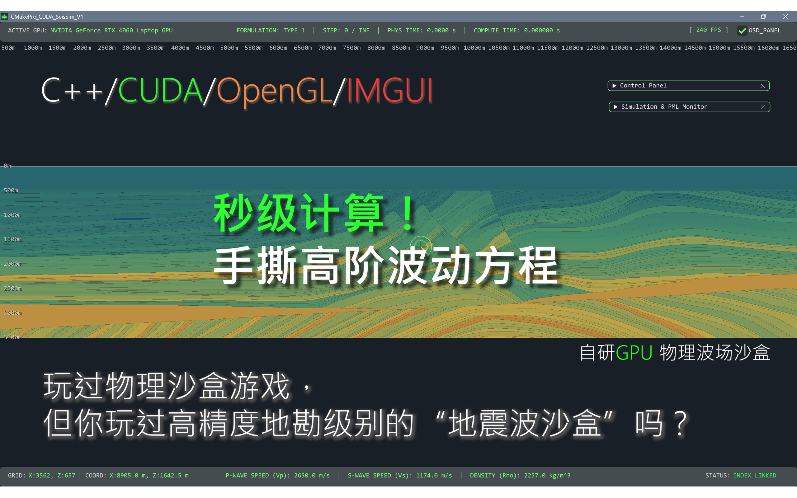
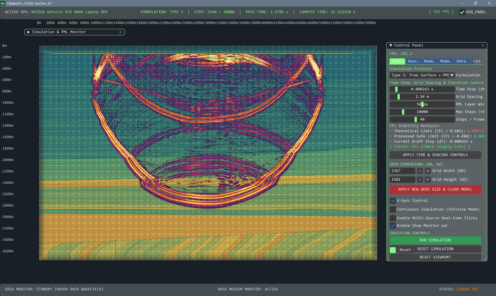
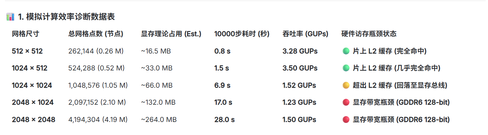

# CMakePro_CUDA_SeisSim_V1

## 二维弹性波场实时数值模拟、采集与分析系统

**CMakePro_CUDA_SeisSim_V1** 是一套基于 **C++17 + NVIDIA CUDA + OpenGL 4.3 + Dear ImGui / ImPlot** 构建的实时二维弹性波场数值模拟与地震数据分析系统。

系统以 GPU 异构并行计算为核心，将弹性波有限差分（FDM）求解、实时波场可视化、地震数据采集、SEG-Y 数据 I/O、地震记录分析以及波场电影回放整合到统一的交互式物理仿真环境中。

项目主要面向：

- 浅层地震勘探与近地表物探
- 计算地球物理与地震学教学
- 弹性波数值方法研究
- 地球物理算法原型验证
- 地震数据生成与可视化
- FWI / Tomography 等科研数据增强

其核心目标是构建一个**参数可调、波场实时演化、数据可采集、结果可分析的 GPU 弹性波物理沙盒**。

---

## 🚀 核心指标

| 项目 | 指标 |
|---|---|
| 编程语言 | C++17 / CUDA |
| GPU 计算 | NVIDIA CUDA |
| 图形渲染 | OpenGL 4.3 |
| UI | Dear ImGui |
| 数据分析 | ImPlot |
| 数值方法 | 8 阶 Staggered-Grid FDM |
| 边界条件 | PML / Free Surface |
| GPU-OpenGL | CUDA-GL Interop |
| 测试 GPU | RTX 4060 Laptop |
| 测试网格 | 1000 × 500 |
| 时间步数 | 10,000 |
| 测试耗时 | 0.995 s |
| 吞吐量 | 5.02 GNUPs |
| 预设场景 | 11 套 |
| 地震采集 | 多通道、双分量 |
| 数据格式 | SEG-Y |
| Trace Header | 240 Bytes |

> 在 `1000 × 500` 网格、PML 宽度为 50 格的测试模型中，RTX 4060 Laptop 上完成 10,000 次时间步更新的实测耗时约为 **0.995 秒**，对应约 **5.02 GNUPs** 的网格点更新吞吐量。

---

## 🖥️ 系统界面







---

# 1. 技术架构

系统采用：

> **状态与参数控制层 → GPU 物理计算层 → GPU 渲染与数据分析层**

的模块化架构，将 UI、物理求解、数据采集和图形渲染进行解耦。

```text
┌──────────────────────────────────────────────────────────────┐
│                 状态与参数控制层 · C++17                     │
│                                                              │
│  GLFW Window    SimState    参数控制    数据 I/O    UI       │
└─────────────────────────────┬────────────────────────────────┘
                              │
                ┌─────────────┴─────────────┐
                │                           │
                ▼                           ▼
┌───────────────────────────┐   ┌──────────────────────────────┐
│      渲染层 · OpenGL 4.3  │   │       计算层 · CUDA          │
│                           │   │                              │
│  FBO 离屏渲染              │   │  8 阶 Staggered-Grid FDM   │
│  Shader                    │   │  PML / Free Surface         │
│  自适应物理标尺            │   │  GPU Receiver Extraction    │
│  ImGui / ImPlot            │   │  CUDA 并行计算               │
└──────────────┬────────────┘   └──────────────┬───────────────┘
               │                               │
               └──────────────┬────────────────┘
                              │
                     CUDA-GL Interop
                       GPU 零拷贝路径
                              │
                              ▼
                 ┌─────────────────────────┐
                 │  实时二维弹性波场显示   │
                 └─────────────────────────┘
```

---

# 2. 数值模拟核心

## 2.1 八阶交错网格有限差分

物理核心基于一阶速度-应力弹性波方程。

空间离散采用 **8 阶 Staggered-Grid FDM**，时间方向采用二阶差分。

主要状态变量包括：

- 质点速度 `vx`
- 质点速度 `vz`
- 正应力 `σxx`
- 正应力 `σzz`
- 剪应力 `σxz`

通过交错网格布置速度与应力变量，可以降低空间差分色散，并改善弹性波传播过程中的数值稳定性。

---

## 2.2 多种边界条件

系统支持三种主要边界配置。

### Type 1 — Full PML

整个计算区域采用分裂场 PML 吸收边界。

### Type 2 — Hybrid FDM + PML

计算区域内部采用经典非分裂场更新，仅在 PML 区域启用分裂变量。

该模式可以减少计算量和显存带宽压力。

### Type 3 — Free Surface

模型顶部采用自由表面边界：

```text
σzz = 0
σxz = 0
```

其余边界采用 PML。

该模式用于模拟自由表面条件下的弹性波传播，包括 Rayleigh 波等面波现象。

---

## 2.3 PML 流固边界稳定化

针对水层等：

```text
Vs = 0
```

的流体介质在弹性波 PML 中可能导致数值不稳定的问题，系统实现了 PML 内部介质稳定化机制。

进入 PML 后，对水层介质进行内部固化处理，将剪切波速度设置为：

```text
Vs = Vp / 2
```

以避免流固介质在 PML 中产生数值奇异和长期发散。

---

# 3. CUDA GPU 性能优化

## 3.1 CUDA-OpenGL Interop

传统 GPU 仿真通常需要：

```text
CUDA GPU
   ↓
GPU → CPU
   ↓
CPU → OpenGL
   ↓
Texture
```

这种路径会产生额外的 PCIe 数据传输和同步开销。

本系统使用：

```cpp
cudaGraphicsGLRegisterImage()
```

将 OpenGL Texture 注册为 CUDA Graphics Resource。

数据路径变为：

```text
CUDA Kernel
     ↓
GPU Memory
     ↓
CUDA-GL Interop
     ↓
OpenGL Texture
     ↓
Shader / FBO
     ↓
ImGui
```

从而减少 GPU ↔ CPU 数据搬运，实现 GPU 内部的数据处理与实时显示。

---

## 3.2 FBO 离屏渲染

计算网格尺寸与 ImGui 视口尺寸并不一定一致。

例如：

```text
Simulation Grid : 2267 × 1401
Viewport         : Dynamic
```

系统通过 OpenGL FBO：

1. 将波场数据映射到纹理；
2. 通过 Shader 完成颜色映射；
3. 在离屏 Framebuffer 中进行比例校正；
4. 最终提交到 ImGui Viewport。

这样可以避免计算网格与窗口比例不一致导致的拉伸和残留问题。

---

## 3.3 GPU Receiver Extraction

传统方法需要：

```text
GPU → CPU
     ↓
完整网格
     ↓
CPU 搜索 Receiver
```

对于大型波场来说，这会造成大量不必要的数据传输。

系统实现：

```cpp
extract_receivers_kernel
```

以及 Host 侧：

```cpp
recordReceiverStepGPU()
```

由 GPU 线程直接读取检波器位置的数据，仅将少量 Receiver 数据复制回 CPU。

例如存在约 120 个检波器时，每个时间步只需要传输几百字节级别的数据，而不是整个波场网格。

---

## 3.4 Read-Only Cache 与代数优化

CUDA Kernel 中：

```cpp
const float* __restrict__
```

用于声明只读介质参数。

同时对有限差分计算中的除法进行优化，将高延迟 Division 转换为预计算 Reciprocal：

```text
Division
   ↓
Pre-computed Reciprocal
   ↓
Multiplication
```

降低 Kernel 中的计算延迟。

---

# 4. 性能表现

## 4.1 RTX 4060 Laptop 实测

测试条件：

```text
Grid       : 1000 × 500
PML Width  : 50
Time Steps : 10,000
GPU        : RTX 4060 Laptop
```

实测：

```text
Total Time : 0.995 s
Throughput : 5.02 GNUPs
```

即约：

> **5.02 Billion Grid Node Updates / Second**

---

## 4.2 L2 Cache

RTX 4060 Laptop 配备 32 MB L2 Cache。

在较小网格规模下，例如：

```text
512 × 512
1024 × 512
```

部分网格数据及 Stencil 邻域可以更充分地利用片上 Cache。

原测试中小规模模型可以获得约：

```text
3.50 GUPs
```

的计算速度。

随着网格规模进一步扩大，性能逐渐受到显存带宽限制。

---

# 5. CFL 稳定性控制

系统根据当前地层模型中的最大纵波速度：

```text
Vp_max
```

实时计算时间步长稳定性限制。

当用户修改：

- `dx`
- `dt`
- 地层模型
- 预设场景

时，系统可以重新计算 CFL 条件。

---

## Auto-Align Time Step

系统提供自动时间步长对齐机制。

在加载预设或模型变化后：

```text
Model
  ↓
Vp_max
  ↓
CFL Limit
  ↓
dt
  ↓
UI Slider
```

自动更新时间步长。

当前自动对齐策略使用：

```text
Courant Number = 0.48
```

作为安全运行参数。

---

# 6. Adaptive Physical Scaling

弹性波场中的不同物理量具有明显不同的数量级。

例如：

```text
Velocity
Stress
Strain
Divergence
Curl
```

直接使用统一颜色增益会造成部分变量过亮或过暗。

因此系统在颜色映射过程中引入 Adaptive Balancer。

对于应力分量：

```text
Stress / Elastic Modulus
```

转换为应变尺度。

然后结合：

```text
v = Vp × ε
```

进行不同物理量之间的尺度平衡。

系统使用约：

```text
2000 ×
```

的物理补偿因子，使不同波场分量可以在统一 Color Gain 下获得较一致的视觉表现。

---

# 7. 核心功能

## 7.1 11 套预设物理场景

系统提供 11 套预设场景，包括：

- Earth Shell & Core
- Young's Double-Slit Interference
- Straight Waveguide
- Curved Waveguide
- Phononic Band-Gap Lattice
- Random Scattering Medium
- Bubble / Scatterer Models
- Penrose Elliptical Focusing
- 以及其他用于教学和物理演示的场景

其中 Earth Shell & Core 场景可以用于展示液态外核：

```text
Vs = 0
```

对横波传播产生的影响。

---

# 8. 地层模型 I/O

## 8.1 模型导入

系统支持：

- ASCII `.txt`
- 二维 SEG-Y `.sgy`

模型导入后可以根据当前模拟网格参数进行重采样。

对于水层等流体区域，还可以在 PML 内部进行稳定化处理。

---

## 8.2 模型裁剪与导出

支持：

- Spatial Cropping
- Horizontal Flip
- PML Boundary Removal
- 2D Resampling
- Downsampling
- Upsampling

例如：

```text
Marmousi
1.5 m native sampling
        ↓
Resampling
        ↓
2.5 m output sampling
```

可以生成用于后续处理的二维 SEG-Y 物性模型。

---

# 9. 多通道地震数据采集

系统提供主动源与被动源地震数据采集流程。

## 9.1 Receiver 布设

用户可以设置：

- Receiver 数量
- 地表布设范围
- Receiver 深度

Receiver 在波场中以黄色倒三角标记显示。

其物理坐标同步至 GPU。

---

## 9.2 双分量采集

支持：

```text
Vx
Vz
```

两个分量的同步采集。

提供两种主要模式：

```text
START CAPTURE
```

被动监听。

以及：

```text
TRIGGER & ACQUIRE
```

主动激发。

主动采集时可以：

1. 清空当前物理场；
2. 重置时间轴；
3. 激发震源；
4. 持续记录 Receiver 数据；
5. 达到录制时长后自动停止。

---

## 9.3 SEG-Y 输出

采集结果可以输出为：

```text
_xx_vx.sgy
_xx_vz.sgy
```

对应水平与垂直分量。

Trace Header 中写入包括：

- 野外记录号
- 道号
- 炮点物理坐标
- 检波点物理坐标
- 采样相关信息

等记录信息。

---

# 10. Seismic Record Analyzer

系统内置基于 **ImPlot** 的地震记录分析模块。

支持：

### Wiggle Display

使用变振幅地震道方式显示：

```text
Trace 1
Trace 2
Trace 3
...
Trace N
```

### Colormap Display

同时支持密度着色显示。

提供包括：

```text
RdBu
Spectral
```

在内的科学色谱。

---

## 大数据渲染优化

分析器自动读取 SEG-Y 中的采样间隔 `dt`。

针对大量道数据，引入动态 LOD / Sampling 策略，减少：

- 过度绘制
- 抗锯齿混叠
- UI 卡顿

---

# 11. Wavefield Movie Replay

系统支持波场电影录制与回放。

数据缓存主要位于：

```text
CPU Memory
```

而不是长期占用 GPU 显存。

回放时仅将当前活动帧上传 GPU。

因此可以降低长时间波场录制对显存容量的压力。

支持：

- 多帧波场录制
- 0.1× 慢速播放
- SAVE
- LOAD
- 自适应 FBO 尺寸
- Raw 二进制时空数据输出

导出的 Raw 数据可以进一步使用 Python 等工具进行后处理。

---

# 12. 交互式物理沙盒

## 12.1 多震源

系统支持多震源实时叠加。

鼠标按压并拖动时，可以沿鼠标轨迹持续生成 Ricker Source。

当前源注入频率约为：

```text
25 Hz
```

每个震源具有独立的衰减生命周期。

因此可以直接观察不同震源之间的：

- 干涉
- 反射
- 绕射
- 波导传播
- 聚焦
- 散射

等现象。

---

## 12.2 精确视口平移

模型平移过程中使用视口比例修正：

```text
aspectCorr
```

并将其加入鼠标中键拖拽计算。

使屏幕像素位移与鼠标移动保持更直接的对应关系。

---

# 13. UI 与操作

系统采用：

> **数据监控 + 波场主视口 + 悬浮控制面板**

的 UI 布局。

```text
┌───────────────────────────────────────────────────────────┐
│ ACTIVE GPU | FORMULATION | PHYS | FPS                     │
├───────────────────────────────────────────────┬───────────┤
│                                               │           │
│                                               │ Controls  │
│                 Wavefield                     │           │
│                                               │ Physics   │
│                                               │ Source    │
│                                               │ Receiver  │
│                                               │           │
│                                               │ Execution │
│                                               │           │
├───────────────────────────────────────────────┴───────────┤
│ GRID | P-WAVE | S-WAVE | STATUS                           │
└───────────────────────────────────────────────────────────┘
```

---

# 14. 快捷键

| 快捷键 | 功能 |
|---|---|
| `Q` | 循环切换物理场分量 |
| `W` | 循环切换科学色谱 |
| `E` | 循环切换地质背景 |
| `Space` | RUN / PAUSE |
| `C` | 清空并重置物理场 |
| `R` | 重置 Viewport / Camera |
| `Tab` | Intro / SeisSim |
| `1` | 单点震源 |
| `2` | 高阻抗高速介质画笔 |
| `3` | 低阻抗低速介质画笔 |
| `4` | 自定义物性画笔 |
| `5` | 橡皮擦 |
| `鼠标中键` | 平移模型 |
| `鼠标滚轮` | 缩放模型 |

### Q — Physics Field

循环切换：

- Velocity Magnitude
- `Vx`
- `Vz`
- Normal Stress
- Shear Stress
- Divergence
- Curl

### W — Colormap

循环切换系统内置科学色谱。

### E — Background

循环切换：

- 钛金灰
- 地质背景
- 灰度速度
- 跟随机背景
- 简约学术白

---

# 15. 应用场景

## 15.1 地球物理教学

系统可以将传统的地震学与弹性波理论转换成实时可视化过程。

例如：

- P 波 / S 波传播
- 横波消失
- 多分量能量投影
- 自由表面反射
- Rayleigh 波
- 波导
- 干涉
- 散射
- 聚焦

适用于：

- 地震学
- 地震勘探原理
- 计算地球物理
- 地球物理实验教学

---

## 15.2 近地表工程物探

在浅层物探、工程检测和地下异常识别等场景中，可以根据现场参数快速构建模拟模型。

潜在用途包括：

- 地下管线探测
- 路基检测
- 矿山采空区探测
- 浅层地震勘探
- 观测系统设计
- 异常体响应预览

---

## 15.3 科研算法原型验证

系统将：

```text
C++ Host
    +
CUDA Solver
    +
OpenGL Visualization
```

进行模块化组合。

因此可以用于快速验证：

- 高阶有限差分算子
- PML 边界条件
- 自由表面条件
- 非规则地表模型
- 震源注入算法
- 弹性波传播算法

算法修改后可以直接在实时波场窗口中观察数值结果。

---

## 15.4 FWI / Tomography 数据生成

系统可以作为地球物理机器学习数据生成工具。

通过自动改变：

```text
Model
Shot Position
Source
Receiver Layout
Physical Parameters
```

批量产生不同地下模型对应的合成地震记录。

输出的 SEG-Y 数据可以进一步用于：

- FWI
- Tomography
- 地震波识别
- 地震数据机器学习
- 深度学习训练集构建

---

# 16. 技术栈

```text
Language
├── C++17
└── CUDA

GPU Computing
└── NVIDIA CUDA

Graphics
├── OpenGL 4.3
├── GLSL
├── CUDA-GL Interop
└── FBO

UI
├── Dear ImGui
└── ImPlot

Window / Input
└── GLFW

Geophysics
├── Elastic Wave Equation
├── 8th-order Staggered Grid FDM
├── PML
├── Free Surface
├── CFL Stability
└── Ricker Source

Data
├── ASCII
└── SEG-Y

Analysis
├── Wiggle Plot
├── Colormap
└── Wavefield Movie
```

---

# 17. 项目定位

CMakePro_CUDA_SeisSim_V1 并不仅仅是一个 CUDA 波场计算 Demo。

它将：

```text
数值计算
   +
GPU 并行
   +
实时渲染
   +
交互式建模
   +
地震数据采集
   +
SEG-Y I/O
   +
地震记录分析
   +
波场回放
```

整合到同一个实时系统中。

其核心价值在于：

> **让弹性波数值模拟从“离线计算结果”变成一个可以实时交互、实时观察、实时采集和实时分析的 GPU 物理实验环境。**

---

# 18. 项目状态

当前系统已经形成较完整的：

```text
GPU Elastic Wave Solver
        ↓
Real-time Wavefield Visualization
        ↓
Interactive Physical Modeling
        ↓
Receiver Acquisition
        ↓
SEG-Y Export
        ↓
Seismic Record Analysis
        ↓
Wavefield Replay
```

完整技术链路。

后续可以进一步围绕 GPU Kernel 优化、更加复杂的地质模型、批量数据生成、数值算法扩展以及地球物理反演算法进行扩展。

---

## License

本项目 License 信息请以仓库实际 LICENSE 文件为准。